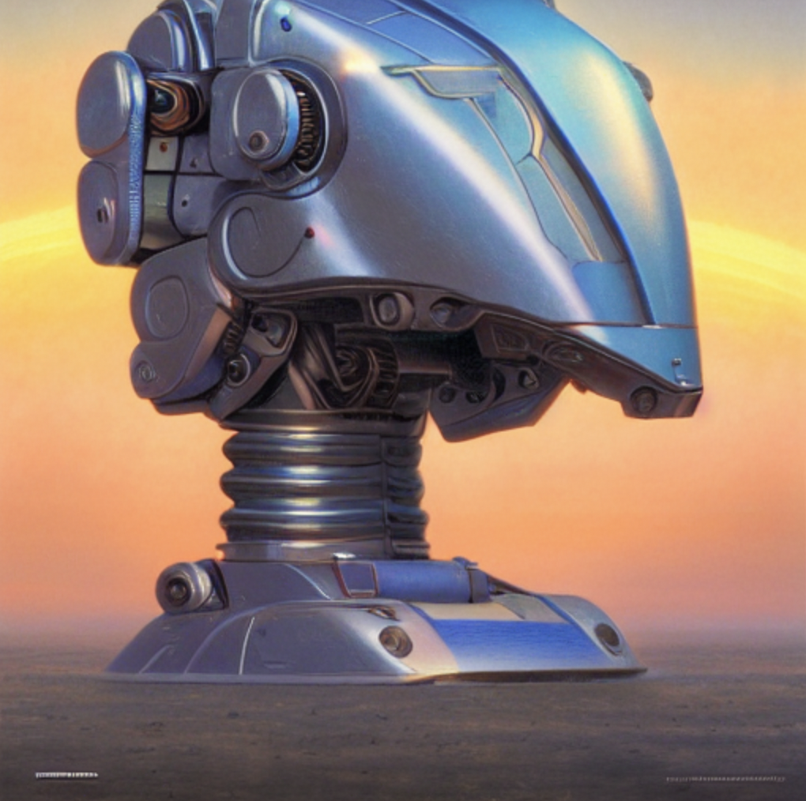
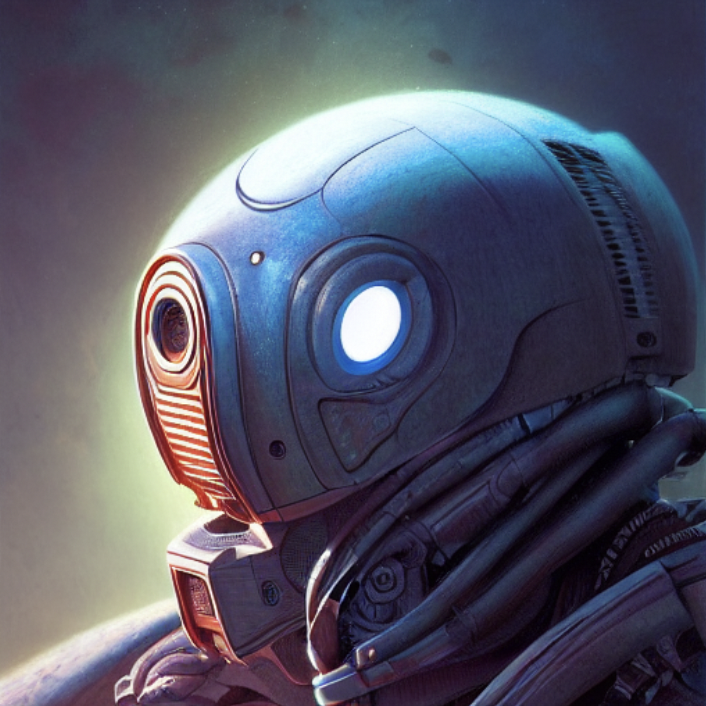

Implementation of Stable Diffusion - Canceled. Check out my [RLHF project](https://github.com/xrsrke/instructGOOSE)
================

<!-- WARNING: THIS FILE WAS AUTOGENERATED! DO NOT EDIT! -->

------------------------------------------------------------------------

This repository contains Stable Diffusion’s implementation in PyTorch.

## Updates

Yes, I am actively working on this project every day. I expect to
complete it by January. My plan is to implementing all the components
from scratch and load the pre-trained weights.

## Install

``` sh
pip install -r requirements.txt
pip install -e .
```

## Usage

``` python
from PIL import Image
from foundation.stable_diffusion import StableDiffusion

prompt = "holy young female battle robot flying award winning, portrait bust symmetry faded tetrachromacycolors arctic background tim hildebrandt wayne barlowe bruce pennington donato giancola larry elmore masterpiece trending on artstation cinematic composition beautiful lighting hyper detailed!!! 8 k oil on canva"

model = StableDiffusion(n_inference_steps=30)
images = model.generate(prompt)

pil_images = [Image.fromarray(image) for image in images]
pil_images[0]
```





## Paper Reviews

### CLIP - Multimodal Neurons

### VAE

Variational Autoencoder (VAE) model with KL loss from the paper
Auto-Encoding Variational Bayes by Diederik P. Kingma and Max Wellin

### UNET

### Diffusion Process

## Contributing

This repository is still a work in progress.<br> Currently, no downloads
and no executables are provided.

I welcome many contributors who can help.

## License

Licensed under the MIT license.
